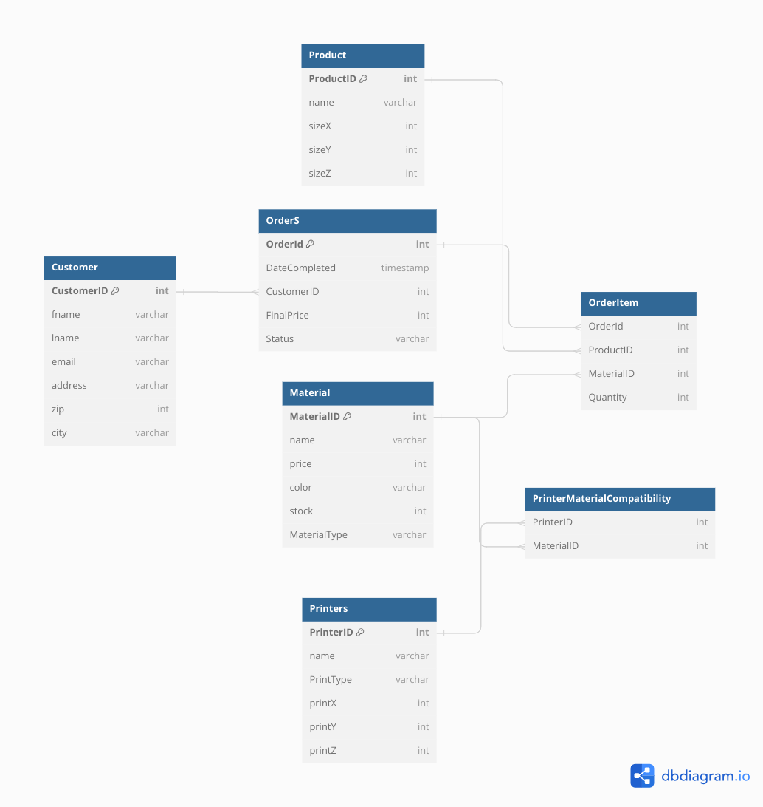

# 3D printing order

Il s’agit d’une entreprise qui fait des impressions 3D pour ces clients en laissant passer des commandes en ligne.

Il permet d’imprimer en filament (FDM) et/ou résine. Plusieurs types de filament ou de résine sont disponibles en différentes couleurs.

Il faut faire intention car une FDM ne peut pas imprimer avec de la résine. Le prix est calculé en fonction de la taille du fichier donné et du matériau choisi.

- **Client** {CustomerID, fname, lname, address, zip, city}
- **Commande** {OrderId, CustomerID, ProductTable, FinalPrice}
- **Produit** {ProductID, sizeX, sizeY, sizeZ}
- **Imprimante** {PrinterID, name, PrintType, printX, printY, printZ}
- **Filament** {FilamentID, name, price, color, stock}
- **Résine** {ResinID, name, price, color, stock}

### **Règles Métier s**

- Compatibilité: Imprimante-Filament/Résine (FDM pour filament, pas pour résine)
- Prix: Calculé selon taille du produit

### **Challenges**
- Les liens entre les produits qui sont liés 

### **Fonctionnalités**

- Calcul du prix: Basé sur dimensions et matériau
- Vérification de compatibilité: Imprimante et matériau
